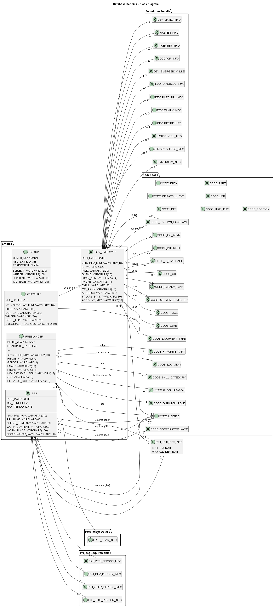
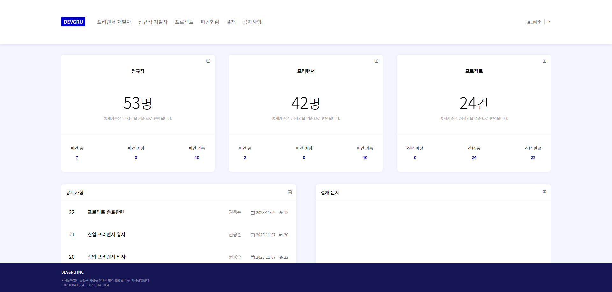
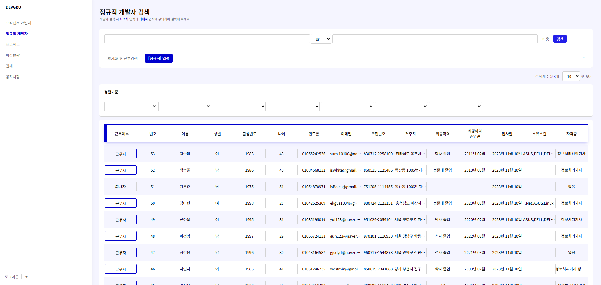
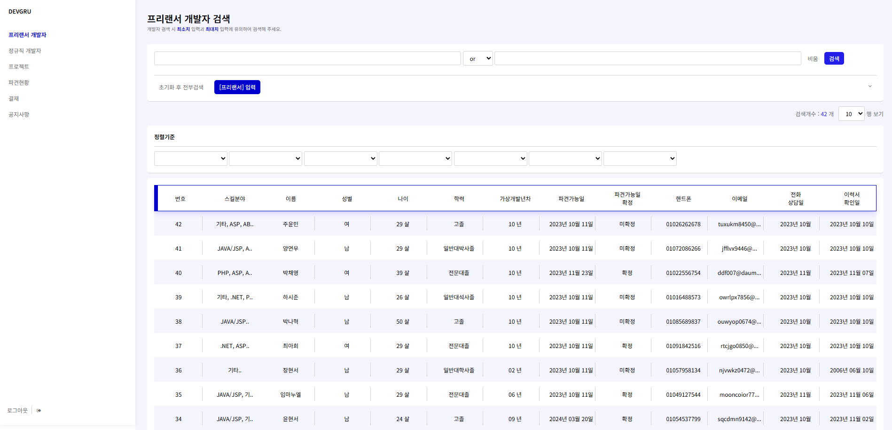
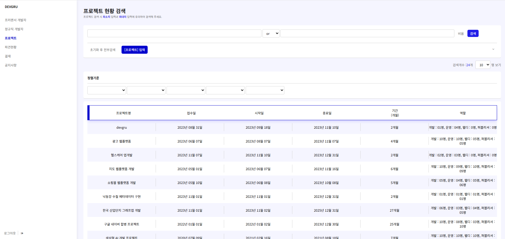
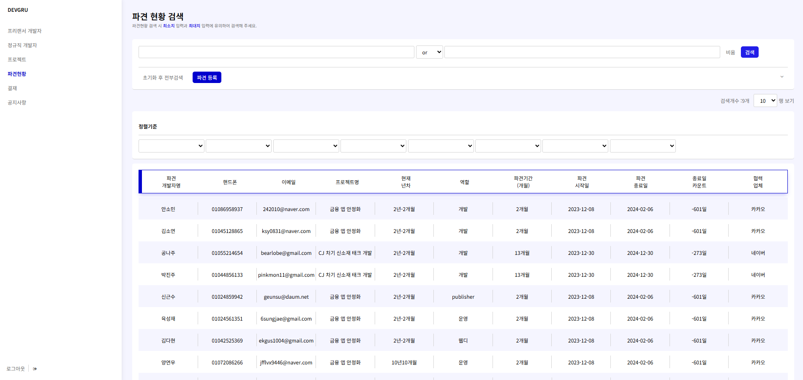
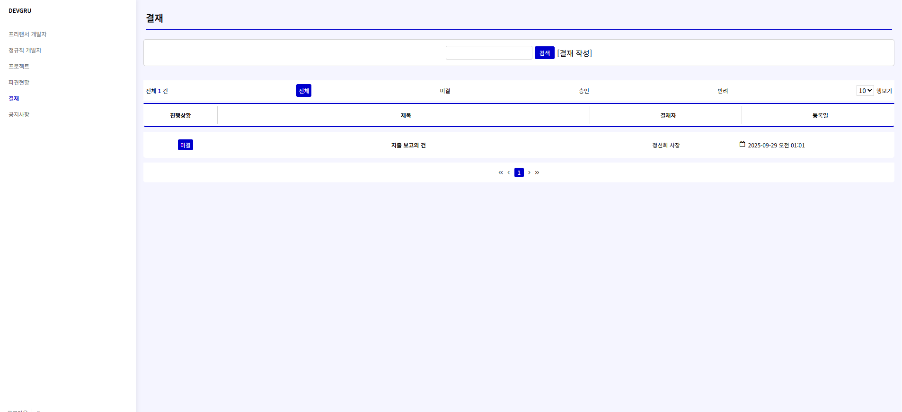
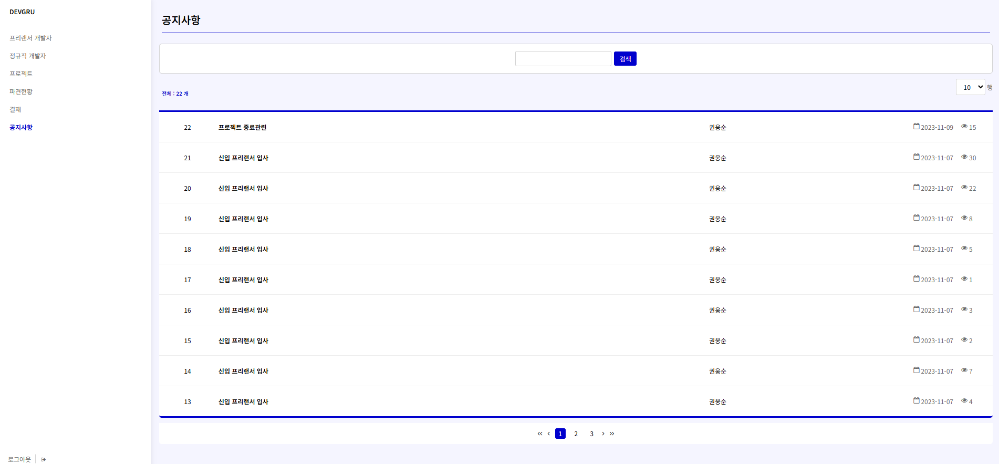

## 개발자 ERP 시스템
개발자, 프리랜서, 프로젝트 정보를 통합 관리하는 ERP 시스템입니다.

## 개발 참여자
- 정선희(조장), 김정학, 김명균, 박소민, 신근수, 안임마누엘, 채병훈

## 개발 기간
- 2023.11 ~ 2023.12 (4주)

## 기술 스택
- 프레임워크: Spring Boot
- 언어: Java, JavaScript, HTML, CSS
- DB: Oracle
- UI 라이브러리: jQuery
- 빌드 도구: Gradle

## 주요 기능
- 개발자·프리랜서 정보 관리 – 개발자 및 프리랜서의 기본 정보와 이력 관리
- 프로젝트 정보 관리 – 프로젝트 개발 기간, 인원, 일정 관리

## 내가 맡은 역할
- 개발자 정보 관리 페이지 기능 구현
- 프로젝트 관리 페이지 기능 구현
- 자료 수집 및 테스트

## 클래스 다이어그램
 
 

## 프로젝트 화면
### 메인
 
 
### 정규직 개발자
 
 
### 프리랜서 개발자
 
 
### 프로젝트 현황
 
 
### 파견 현황
 
 
### 결재
 
 
### 공지사항
 
 

## 문제점 및 해결방안
### 작품 개발 측면
devgru는 첫 팀 프로젝트이며 총 7명의 팀원이 협업하며 진행되었습니다.  
팀원 중 한명이 웹 퍼블리셔로 1년간 일한 경험이 있어 디자인이 이쁘게 나왔습니다.  
프로젝트를 진행하던 당시 깃허브를 사용하지 않고 알집으로 만들어 공유했습니다.  
당연히 병합은 제대로 되지 않았고 누가, 어떤 내용을 수정했는지 알기 어려웠던 문제가 있었습니다.  
     
### 해결 방안
모든 팀원이 각자 다른 임무를 부여받아 서로 작업 파일이 겹치지 않게 했습니다.  
모든 팀원은 팀장의 프로젝트 폴더를 다운받아 작업을 했고, 작업이 끝나면 팀장에게 수정된 파일을 주고 수정 내용을 보고했습니다.  
팀장은 받고 합친 후 해당 팀원에게만 팀장의 폴더를 재공유 하여 문제를 해결했습니다.  
